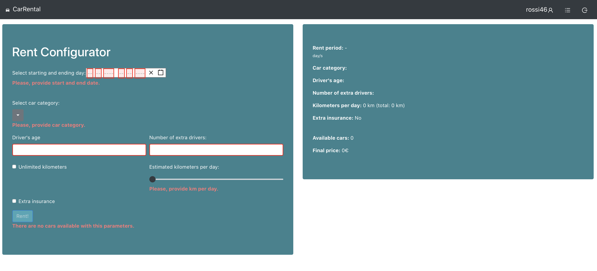
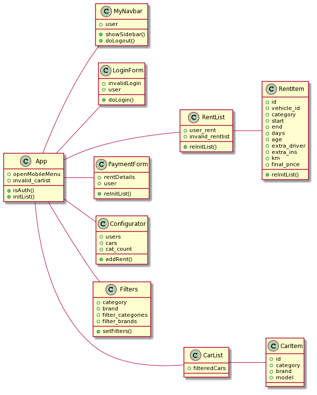

# Exam #1: "Car Rental"
## Student: s277197 CIRELLA AURELIO 

## React client application routes

- Route `/`: main application page, it contains the list of catalogue cars and the correspondent filters
- Route `/login`: login form in which is possible to provide user credentials and login the application main functionalities 
- Route `/user/rentlist`: list of ended, active and future user rents
- Route `/user/configurator`: configurator form to make the user to ask for a new rent
- Route `/user/configurator/payment`: payment form to perform payment

## REST API server

- POST `/login`
  - Request body: object describing user credentials { uname, uname}
  - Response body: object describing user { userID, name}
- POST `/logout`
   
 *It asks the browser to delete its token containing authentication rights*
  - Request body: empty
  - Response body: empty 
  
- GET `/cars`
  - Request body: empty 
  - Response body: Array of objects, each describing Cars
  - Errors: return a json object representing the kind of error encountered
  
- GET `/isAuth`
  - Request body: empty
  - Response body: json object containing username {username}
  - Errors: return a json object representing the kind of error encountered
  
- POST `/user/configurator/availability`
  - Request body: object describing an Rental date and category details { cat, date }
  - Response body: object descibing garage availability {#available, available_vehicle_id }
  - Errors: return a json object representing the kind of error encountered

- POST `/user/configurator/history`
  - Request body: object describing user {username}
  - Response body: object descibing user history {total}
  - Errors: return a json object representing the kind of error encountered

- POST `/user/configurator/payment/sendpayment`
  - Request body: object describing credit card details {accountholder,ccnumber,ccv}
  - Response body: object descibing payment outcome {paid}
  - Errors: return a json object representing the kind of error encountered
  
- POST `/user/configurator/payment/addrent`
  - Request body: object describing rent details {age,age,date,ex_insurance,final_price,km,n_days,unlimited_km}
  - Response body: object descibing added rent {/*attributes as above*/}
  - Errors: return a json object representing the kind of error encountered

- GET `/rent/:user`
  - Parameter: username
  - Response body: Array of objects, each describing user Rentals
  - Errors: return a json object representing the kind of error encountered

- DELETE `/rent/:rentID`
  - Parameter: username
  - Response body: empty 

## Server database

- Table `Users(id,username,email,password)` - contains details about users registered to the application
- Table `Reservations(cat,km,n_days,start,end,age,extra_driver, extra_ins,username,vehicle_id,final_price)` - contains rents details
- Table `Vehicles(id,category,brand,model)` - contains details about vehicles in the catalogue

## Main React Components

- `MyNavbar` (in `/Components/MyNavbar.js`): it allows user to navigate among application views. 
- `Filters` (in `/Components/Filters.js`): it allows to apply filters to car list catalogue.
- `CarList` (in `/Components/CarList.js`): it displays list of cars in the catalogue.
- `LoginForm` (in `/Components/LoginForm.js`): it allows the user to provide its credentials to login the application.
- `Configurator` (in `/Components/Configurator.js`): it allows the user to ask for a new rent providint rent details.
- `PaymentForm` (in `/Components/PaymentForm.js`): it allows the user to perform the payment providing credit card details.
- `RentList` (in `/Components/RentList.js`): it displays the list of ended, active and future user rents.

## Configurator Screenshot

 

## Test users

* rossi46, 123456(frequent customer) - *login with this user to check RentList formatting*
* green1, 654321
* karl87, qwerty 
* georgie_1, 0987654321
* iris10, poiuyt 

*To verify if the discout for when available cars are less than 10% of the overall cars of the same category try to rent a car for the <b>10/09/2020</b>.*

## Project React Structure
